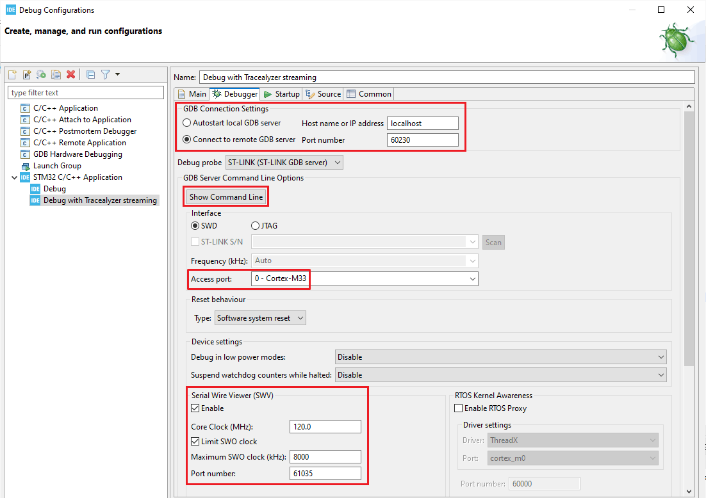
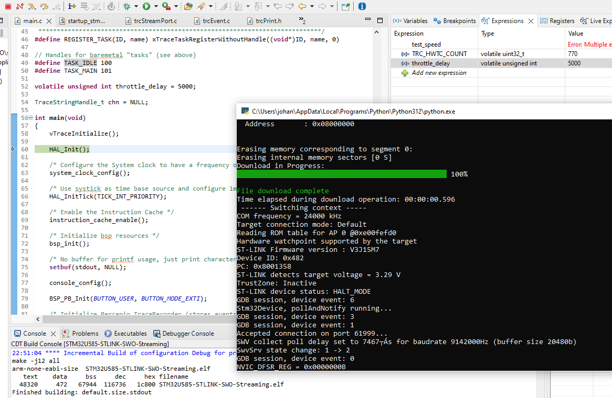
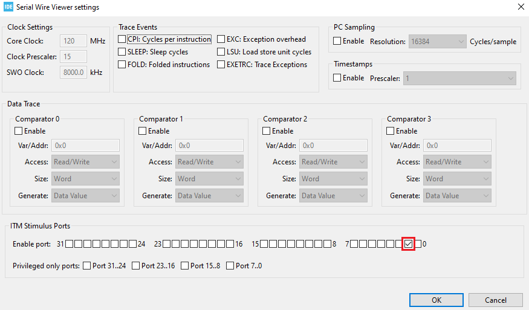
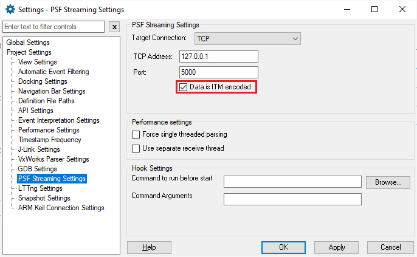
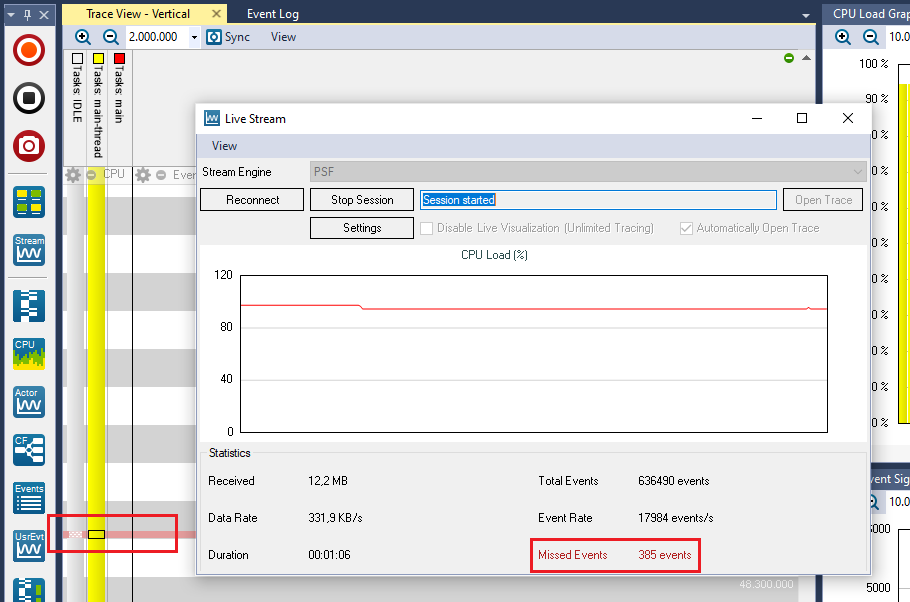

# Tracealyzer streaming with STLINK v3

This example project shows how to use Tracealyzer with the STLINK v3 to stream TraceRecorder data
with good performance on STM32 microcontrollers. In our experiments, trace data can be streamed
at 600-700 KB/s, and typically for over 10 minutes without losing a single byte.

The project is for the [B-U585I-IOT02A](https://www.st.com/en/evaluation-tools/b-u585i-iot02a.html) board and uses the integrated STLINK v3 on the board.
This setup can easily be replicated for other STM32 devices using STLINK debug probes on cores like Arm Cortex-M3, M4, M7, M33 and above.
The STLINK v2 is also supported in theory, but only supports SWO speeds up to 2 MHz which limits the applicability for RTOS tracing.

[Percepio TraceRecorder](https://github.com/percepio/TraceRecorderSource) supports various popular real-time
operating systems such as FreeRTOS and Zephyr, as well as bare metal applications. 

The demo project is a minimal bare-metal application with a simple loop producing TraceRecorder
events, mainly intended to test the performance and reliablity of the STLINK streaming.
This is not intended to demonstrate the full capabilities of Tracealyzer.

Learn more about Tracealyzer on the [Tracealyzer product page](https://percepio.com/tracealyzer).

## Setup

1. Integrate TraceRecorder and select the ARM_ITM streamport, as decribed on the
[Tracealyzer Getting Started](https://percepio.com/tracealyzer/gettingstarted), in the guide matching your RTOS.
Note that this is already done in this example project.

2. Open **Debug Configurations** in STM32CubeIDE and create a new entry.
   
   Set a suitable name, for example "Debug with Tracealyzer streaming".
   
   2.1. On the **Debugger** page, enter the following configuration:
   
   
   
    - Connect to remote GDB server: Checked
    - Host name or IP address: localhost
    - Port number: 60230

    - Serial Wire Viewer: Enabled
    - Core clock: (your core clock speed)
    - Limit SWO clock: Checked
    - Maximum SWO clock (KHz): 8000
    - Port number: 61035
	
	**Note:** The port numbers are the defaults, but can changed if already in use. 
    However, changing the port numbers requires that you also update these in the
    associated scripts. See the Troubleshooting section in the end.
	
	2.2. Click on the "Show Command Line" to see how to start the STLINK GDB server.
	     
    
		 
    Copy the path to the STLINK GDB server. Open **settings.py** and update **GDB_SERVER_PATH**.
	Make sure to keep the special python formatting (GDB_SERVER_PATH = r'path').
		 
    
		 
    Also copy the second path (the STLINK programmer tool directory) and update **STLINK_PROG_DIR** in settings.py.
	Save your updated settings.py.
	   
    2.3. On the **Startup** page, add the following in the **Run Commands** field.
    
    - On Windows: shell start /b python swo-reader-tcp.py
	
    - On Linux: TBD
		 
         

3. Next step is to add the GDB server script as an "External Tool" in STM32CubeIDE.
   
   - Locate the "External Tools" dropdown menu and select External Tools Configuration.
   
     
	 
   - Set a suitable name, e.g. "GDB server with trace output".	 
   
     
	    
   - Under "Location", select "Browse File System" and select
     the **stm32cubeide_external_tool_start_gdb_server** script, 
	 the .bat variant if using Windows or the .sh variant if using Linux.
   
   - Under "Working Directory", select your project root folder.
   
   - Save and close.
   
4. To test the new debugging setup, two steps are needed with this approach:
 
   - Start the **GDB server**, using your new "external tool" shortcut.
  
   - Start your new Debug Configuration using the **Debug button**. Make sure to select the right Debug Configuration.
     Clicking the Debug button will launch the latest used configuration.
	 
	 
	 
	 Make sure your debugging works as expected, i.e. stepping, breakpoints and so. 
	 The GDB server window can be minimized, but closing it will kill your debug session.
	
  
5. Inside your debug session, open **SWV Trace Log** (see Show View -> SWV).
   
   
  
6. Click on the **Configure trace** button.

   Enable ITM port 1. Disable everything else. 
   
   Click OK.
   
   

7. In **SWV Trace Log**, use the **Start Trace** button to enable trace output on your device.
   
   
   
8. Close the debug session. The settings are stored in your project.

9. Open Tracealyzer and go to **File** -> **Settings**.
   - Select **PSF Streaming Settings**
   
   
   
   - Target Connection: TCP
   - TCP address: 127.0.0.1 (your local computer)
   - Port: 5000
   - Data is ITM encoded: Checked
   
   
## Usage

   1. Start the GDB server using the "External Tool" shortcut.
      	  
   2. Click the Debug button to launch your debug configuration.
      But let it remain halted for now.
      
   3. In Tracealyzer, open the **Trace** menu and select **Open Live Stream Tool**.
      Decide if you want Live Visualization using the checkbox.
      Then click **Connect** and **Start Session**.
	  
	  
	        
   4. In STM32CubeIDE, now start the execution.
			
   5. In Tracealyzer, check the Live Stream window for a notice about "Missed events".
      If this notice shows up, follow the advice in the "Troubleshooting" section below.
	  Tracealyzer needs a complete data stream to ensure correct display of the trace.
	  
	  
	  
   6. You can generate higher data rates for stress-testing the solution by reducing the value
	  of **throttle_delay** in main.c. This can be done within a debug session by pushing the
	  blue user button on the board, or by halting the debug session and editing the value in
	  the "Expressions" window. The default value of 5000 results in a data rate of around 160 KB/s,
	  while setting it to 0 results in maximum data rate.

## Troubleshooting:

### Missed Events
 Missed events are detected and reported by Tracealyzer. In case you see Missed Events, make sure
 to resolve such issues before studying the traces in Tracealyzer, otherwise the displayed data might not be correct.

 There seem to be two main reasons for missed events when using this approach:
 
 1. **Too high SWO frequency:** 7-9 MHz seems reliable, but in our experiments STM32CubeIDE
 selected 12 MHz by default (core clock divided by 10) which resulted in occational missed
 events also at lower event rate. It is recommended to select "Limit SWO frequency" and specify
 a lower value, for example 8 MHz.
 
 2. **Too high host-side system load:** Depending on the performance and load on your host
 computer, it seems there can be occational overflows in the (pretty small) SWO buffer in the
 STLINK GDB server. For example, if using live visualization combined with high data rate,
 on a somewhat slow computer.
 
 If you see a small number of occational Missed Events, i.e. increments of 1 (or a few), 
 while the data rate is low (say, below 250 KB/s), it is probably a transmission error due to using
 too high SWO frequency. This is especially likely if using an SWO frequency is high, above 8 MHz. 
 In that case, try reducing the SWO frequency in steps of 500 Khz until no Missed Events occur.
 You find this setting in your STM32CubeIDE Debug Configuration on the "Debugger" page ("Limit SWO clock").
 
 If you see larger increments in the Missed Events, where the counter suddenly jumps by tens or
 hundreds of missed events, it is probably due to the host-side overflow issue. In this case, 
 make sure to disable live visualization in Tracealyzer. This is done by selecting **Open Live Stream Tool** in the **Trace** menu and enable the checkbox
 **Disable Live Visualization** before connecting and starting the session.
 
 Disabling Live Visualization is usually what has the largest effect.
 But you can also try the following:
 
 - Close any open application that isn't needed at the moment.
 
 - Reduce the scheduling priority of the Tracealyzer application.

 - Reduce the data rate from TraceRecorder using the settings in trcConfig.h.
   For example, tracing of OS Tick events is usually redundant and can be disabled.
   Also, if you added custom events like tracing interrupt handlers or "User Events"
   in frequently executed code, you can try commenting them out.

 - Reduce the SWO frequency to ensure there is not transmission errors. For example 6 MHz.

### Busy TCP ports

 If the default port numbers are already in use, the scripts will fail
 and log an error message in **trace_error.log** in the project root folder.
 In this case, open **settings.py** and try a different port number for the
 setting mentioned in the error message.
 
 If changing the port number in settings.py, make sure to read the associated comments.
 Most have corresponding settings in "the other end", i.e. in the STM32CubeIDE debug
 configuration or in the Tracealyzer settings, and they need to match.

## How this solution works

 The SWO data is provided by the STLINK GDB server on a TCP port, but
 STM32CubeIDE will normally connect to this port and consume all data.

 This solution therefore starts the GDB server with a different SWO port
 number, that STM32CubeIDE is not aware of. To avoid a TCP connection error
 in STM32CubeIDE, the solution also provides a "dummy" TCP port that is
 specified as SWO port in the STM32CubeIDE debug configuration. Otherwise
 the connection error is STM32CubeIDE will disable the SWO output.
 
 A second python script ("swo-reader-tcp.py") connects to the GDB server's
 SWO port and reads the data into a queue. Another thread reads the queue
 and send the data to Tracealyzer using a different TCP socket. This made
 the solution a lot more reliable.

Copyright (c) Percepio AB.